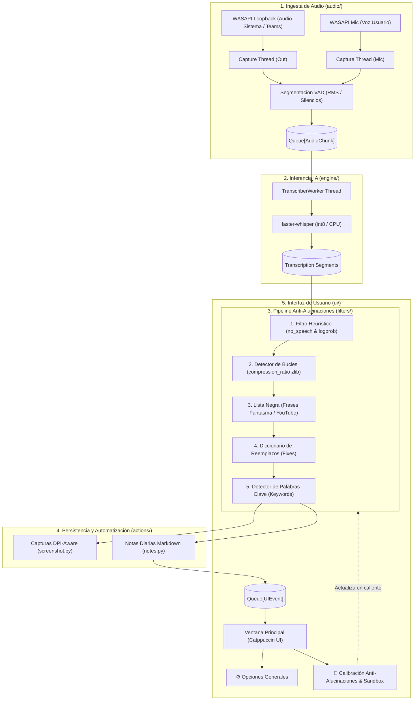

# Arquitectura del Sistema - Recorder (Fase 2)

Este documento describe la arquitectura modular de **Recorder**, diseñada para la captura de flujos de audio en tiempo real, transcripción automática mediante Inteligencia Artificial (Whisper), filtrado avanzado anti-alucinaciones y generación de notas con capturas de pantalla automáticas.

---

## 1. Visión General

El sistema sigue una arquitectura por capas desacoplada (**Clean Architecture**) combinada con un **Pipeline Productor-Consumidor Concurrente**.

---

## 2. Descripción de Componentes

### 2.1. Ingesta y Audio (`recorder/audio/`)
* **`devices.py`**: Interfaz con `pyaudiowpatch` para consultar la API WASAPI de Windows. Resuelve dispositivos físicos de entrada (micrófono) y dispositivos virtuales de loopback (altavoces/auriculares para escuchar a otros participantes).
* **`processing.py`**: Funciones puras de procesamiento digital de señales:
  * `rms(pcm)`: Cálculo de valor cuadrático medio para niveles de volumen.
  * `bars(rms)`: Conversión a escala logarítmica (-60 dB a 0 dB) representada en bloques `█░`.
  * `to_16k(pcm, rate, channels)`: Remuestreo y mezcla a mono en formato `float32` a 16.000 Hz.
* **`capture.py`**: Gestiona los hilos de lectura continuos. Segmenta el audio detectando silencios entre frases (`PAUSE_SEC = 0.6s`) o al alcanzar un máximo de tiempo (`MAX_SEC = 20s`).

### 2.2. Motor de Inferencia (`recorder/engine/`)
* **`whisper_worker.py`**: Hilo consumidor que procesa los fragmentos de audio (`AudioChunk`) mediante la biblioteca `faster-whisper`.
* Soporta la actualización en caliente del pipeline de filtrado sin necesidad de recargar el modelo de IA de la memoria.

### 2.3. Pipeline Anti-Alucinaciones (`recorder/filters/`)
* **`normalizer.py`**: Normalización Unicode NFKD (descompone caracteres con tildes y convierte a minúsculas).
* **`quality.py`**: Valida métricas internas de inferencia de Whisper (`no_speech_prob`, `avg_logprob`) y calcula el ratio de compresión zlib para evitar bucles repetitivos.
* **`blacklist.py`**: Descarta transcripciones completas si coinciden con patrones típicos de alucinación en silencios.
* **`lexicon.py`**: Aplica un diccionario fonético personal basado en límites de palabra (`\b`) para corregir términos técnicos o nombres propios mal reconocidos.
* **`keywords.py`**: Detecta palabras clave de acción configuradas para disparar capturas.
* **`pipeline.py`**: Encapsula todo el flujo en una clase reutilizable `TextPipeline` y proporciona un método `test_sample()` para pruebas interactivas en la UI.

### 2.4. Automatización y Salida (`recorder/actions/`)
* **`screenshot.py`**: Obtiene coordenadas precisas de cada monitor respetando el escalado DPI de Windows (`ctypes.windll.shcore.SetProcessDpiAwareness(2)`) y captura la pantalla seleccionada con Pillow.
* **`notes.py`**: Mantiene abierta la sesión diaria en un archivo `.md`. Coordina el acceso concurrente mediante un cerrojo (`threading.Lock`) y permite trasladar la carpeta de notas en caliente.

### 2.5. Presentación Gráfica (`recorder/ui/`)
* Construida en Tkinter con diseño oscuro Catppuccin Mocha.
* **`main_window.py`**: Visor en tiempo real, sondeo de eventos cada 200 ms y medidores de nivel `🔊 █░   🎤 █░`.
* **`dialogs/settings_dialog.py`**: Configuración de dispositivos, carpetas y monitores.
* **`dialogs/tuning_dialog.py`**: Ventana dedicada para calibración de alucinaciones, umbrales y probador en vivo (sandbox).

---

## 3. Modelo de Concurrencia y Flujo de Datos

1. **Hilos de Captura (2)**: Leen audio de baja latencia mediante WASAPI, calculan RMS en cada frame y depositan `AudioChunk` en una cola `chunk_queue`.
2. **Hilo de Inferencia (1)**: Espera en `chunk_queue.get()`, realiza la inferencia con Whisper, ejecuta el pipeline de filtros y guarda en el archivo Markdown.
3. **Hilo Principal (GUI)**: Ejecuta el bucle de eventos de Tkinter y sondea la cola `ui_queue` periódicamente, garantizando que la interfaz nunca se congele.
